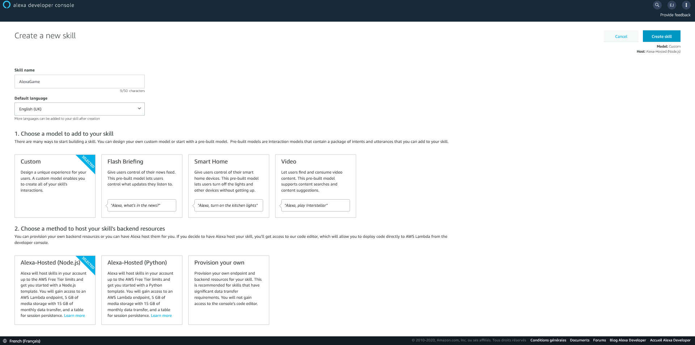
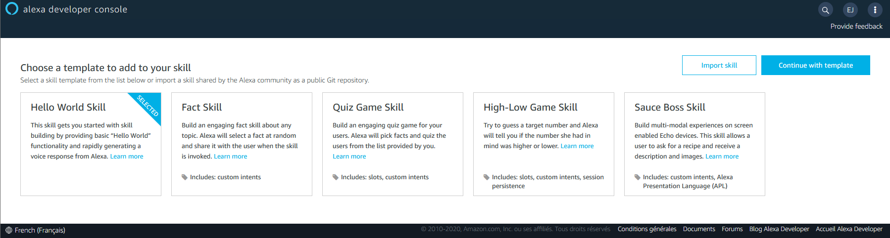
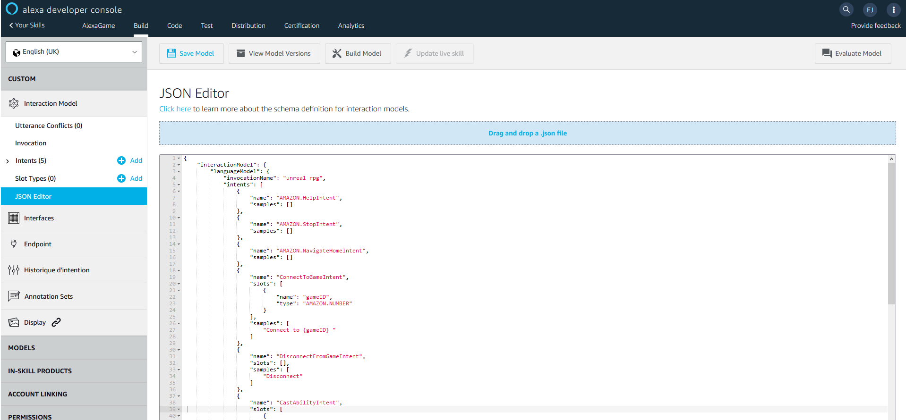
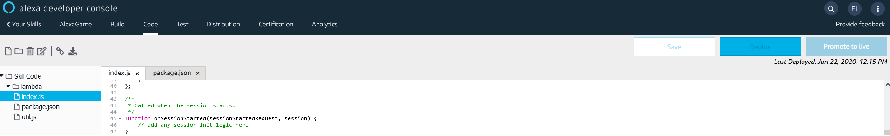
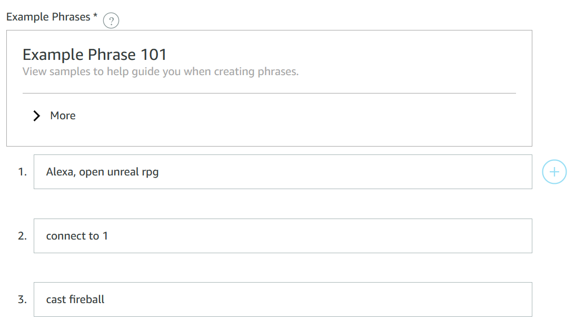

# Folder summary

## Get used to Alexa

Learn how Alexa skills work and create one using the following videos:

https://www.youtube.com/watch?v=d12DhlFVERc

https://www.youtube.com/watch?v=5zsKViLKhi0

## HTTP Request

Learn how to do a HTTP request from an Alexa skill using the following video

https://www.youtube.com/watch?v=4Jdo85l1OI8

## AlexaRPG

The skill use to send vocal commands to the game server

### How to set it in the dev console

Go to your Alexa dev console at https://developer.amazon.com/alexa/console/ask

Create a custom auto hosted skill in nodeJS with English as the default language.

Chose the Hello World template.

When the skill is created, go to the JSON Editor in the build section section and drop the intentSchema file from the speech asset folde.

Build the model.

In the code section change the content of the index.js and package.js files to the content of the files in the src folder.

Change the url in the url function in the index.js file to your heroku server url.

Deploy your changes.

In the distribution section, change the example phrases to have:

1	Alexa, open unreal RPG

2	Connect to 1

3	Cast fireball

Then you can test the skill in the test section.

## Commands

The invocation name of the skill is "unreal rpg" - so just say "Alexa open unreal rpg"

To connect to a game session used "connect to {the id of the session}"

(you can find the id in the top right corner of the game)

To open the inventory use "Open Inventory" or  "Inventory"

To cast a spell use "cast {name of the spell}"

The spell names are the same that the one in the game (heal, rage, fireball and pillar of fire)

to disconnect from the session use "disconnect"
